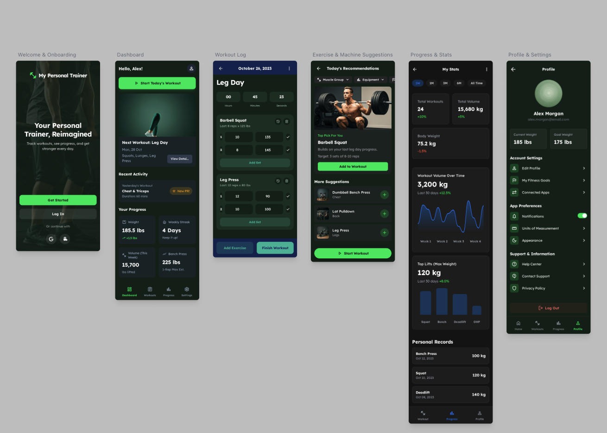

# My Personal Trainer 💪

> An AI-powered Progressive Web App for personalized fitness training and workout planning



## 🚀 Technology Stack

| **Frontend** | **Backend** | **Database** |
|-------------|------------|--------------|
| ⚛️ React (latest) | 🔥 HonoJS | 🐘 PostgreSQL |
| 📘 TypeScript | | |
| ⚡ Vite PWA | | |

## 🌟 Features

✅ **PWA Capabilities**
- 📱 Installable on any device
- 🔄 Offline support
- 🔔 Push notifications
- 📳 Add to Home Screen

✅ **Smart Training**
- 🤖 AI-powered workout recommendations
- 📊 Progress tracking & analytics
- 📋 Personalized workout plans
- 📱 Responsive design across all devices

## 🛠️ Getting Started

### Prerequisites
```bash
Node.js v18+
npm or yarn
Docker (for deployment)
```

### 📦 Installation
```bash
git clone https://github.com/devdaviddr/my-personal-trainer.git
cd my-personal-trainer
npm install
```

### 🚀 Local Development
```bash
# Start development server
npm run dev

# Open browser at
http://localhost:5173
```

### 🏗️ Local Production Build
```bash
npm run build
npm run preview
```

### 🐳 Docker Development
```bash
# Build and run with Docker
docker-compose up --build

# Access at
http://localhost:3000
```

## 📱 PWA Features

| Feature | Description |
|---------|-------------|
| 🔧 **Service Worker** | Intelligent caching for offline functionality |
| 📋 **Web Manifest** | App metadata for native-like installation |
| 🔒 **HTTPS Ready** | Secure connection for full PWA capabilities |

## 🌐 Deployment

### 🖥️ VPS Deployment with Docker

#### Production Setup
```bash
# Clone repository on your VPS
git clone https://github.com/devdaviddr/my-personal-trainer.git
cd my-personal-trainer

# Build and deploy with Docker
docker-compose -f docker-compose.prod.yml up -d
```

#### Environment Variables
Create a `.env` file:
```bash
DATABASE_URL=postgresql://username:password@db:5432/personal_trainer
NODE_ENV=production
JWT_SECRET=your-secret-key
```

### ☁️ Cloudflare Tunnel Setup

#### Install Cloudflare Tunnel
```bash
# Install cloudflared on your VPS
curl -L --output cloudflared.deb https://github.com/cloudflare/cloudflared/releases/latest/download/cloudflared-linux-amd64.deb
sudo dpkg -i cloudflared.deb
```

#### Configure Tunnel
```bash
# Authenticate with Cloudflare
cloudflared tunnel login

# Create tunnel
cloudflared tunnel create my-personal-trainer

# Configure tunnel (tunnel.yml)
tunnel: <tunnel-id>
credentials-file: /home/user/.cloudflared/<tunnel-id>.json
ingress:
  - hostname: trainer.yourdomain.com
    service: http://localhost:3000
  - service: http_status:404
```

#### Run Tunnel
```bash
# Start tunnel
cloudflared tunnel run my-personal-trainer

# Or as a service
sudo cloudflared service install
```

### 🔧 Local Testing
For local development and testing:
```bash
npm run dev    # Development server
npm run build  # Production build
npm run preview # Preview production build
```

## 🤝 Contributing

We welcome contributions! Here's how:

1. 🍴 Fork the repository
2. 🌿 Create a feature branch (`git checkout -b feature/amazing-feature`)
3. 💾 Commit your changes (`git commit -m 'Add amazing feature'`)
4. 📤 Push to branch (`git push origin feature/amazing-feature`)
5. 🔃 Open a Pull Request

## 📄 License

This project is licensed under the **MIT License** - see the [LICENSE](LICENSE) file for details.
